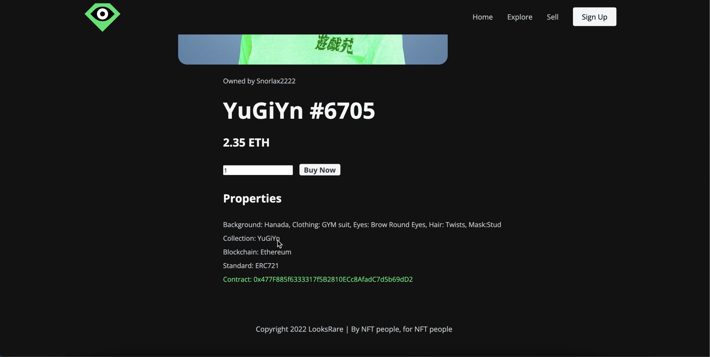

# NFT-Marketplace
Building an NFT Marketplace Website: Enabling artists and collectors to showcase and trade their unique digital creations on a secure and transparent platform

This GitHub repository contains the code and resources for building an NFT marketplace website. The website serves as a platform for buying, selling, and trading non-fungible tokens (NFTs)

### ER Diagram

### Features
User registration and authentication
Creation and listing of NFTs
Marketplace for browsing and discovering NFTs
Buying and selling NFTs using cryptocurrencies
Wallet integration for managing NFT ownership
Social features for engaging with creators and collectors

Technologies
The NFT marketplace website is built using the following technologies and frameworks:

Web development framework (React JS, HTML, CSS)
Backend server (PHP)
Database (MySQL)
Wallet integration (Metamask)

### To get started with the NFT marketplace website, follow these steps:

Clone the repository: git clone https://github.com/fahad0071/-NFT-Marketplace.git
Install the required dependencies and libraries.
Configure the blockchain network and smart contracts.
Set up the backend server and database.
Implement the frontend components and user interface.
Integrate wallet functionality for NFT transactions.
Test the website thoroughly to ensure proper functionality.
Deploy the website to a hosting platform or a decentralized storage solution.
For detailed instructions and code explanations, please refer to the documentation in the docs folder.

### Contributing
Contributions are welcome! If you'd like to contribute to this project, please follow these guidelines:

Fork the repository and create a new branch.
Make your changes and ensure they're properly documented.
Submit a pull request with a detailed description of your changes.
License
This project is licensed under the MIT License. Feel free to use and modify the code as per the terms of the license.

We hope that this repository provides a solid foundation for building your own NFT marketplace website. Feel free to explore, contribute, and enhance the functionality to create a vibrant platform for artists, collectors, and enthusiasts.

For any questions or suggestions, please reach out to us. Happy trading!

LinkedIn : https://www.linkedin.com/in/
